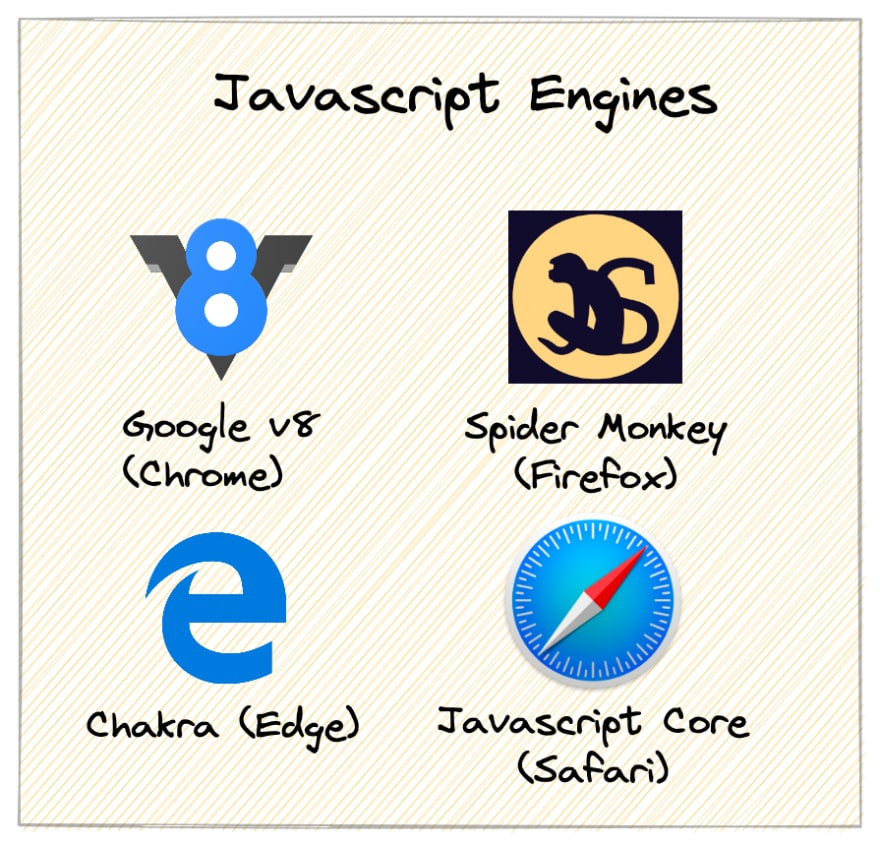
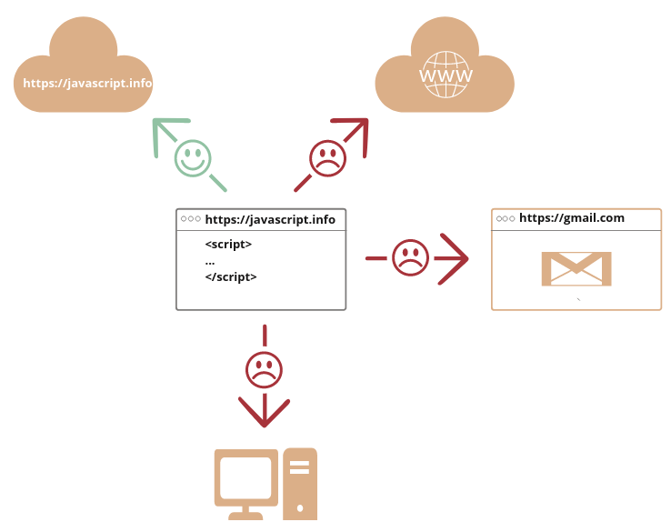
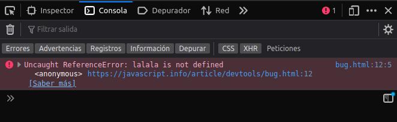

# DWEC UT01: Arquitecturas y lenguajes de programación en clientes web.

## Introducción a Javascript

JavaScript se creó inicialmente para "**dar vida a las páginas web**".

Los programas en este lenguaje se denominan scripts. Se pueden escribir directamente en el HTML de una página web y ejecutarse automáticamente a medida que se carga la página.

Los scripts se proporcionan y ejecutan como texto sin formato. No necesitan preparación especial o compilación para funcionar.

En este aspecto, JavaScript es muy diferente de otro lenguaje llamado [Java](https://en.wikipedia.org/wiki/Java_(programming_language)).

> #### *De donde viene el nombre "JavaScript"?* 
> Cuando se creó JavaScript, inicialmente tenía otro nombre: “LiveScript”. Pero Java era muy popular en ese momento, por lo que se decidió que ayudaría posicionar un nuevo lenguaje como un "hermano menor" de Java.
> Pero a medida que evolucionó, JavaScript se convirtió en un lenguaje completamente independiente con su propia especificación llamada [ECMAScript](https://en.wikipedia.org/wiki/ECMAScript), y ahora no tiene ninguna relación con Java.

Hoy en día, JavaScript puede ejecutarse no solo en el navegador, sino también en el servidor, o en realidad en cualquier dispositivo que tenga un programa especial llamado motor de JavaScript.

El navegador tiene un motor incorporado, a veces llamado "máquina virtual de JavaScript".

Diferentes motores tienen diferentes "nombres en clave". Por ejemplo:

* V8: en Chrome, Opera y Edge.
* SpiderMonkey – en Firefox.
* …Hay otros nombres en clave como “Chakra” para IE, “JavaScriptCore”, “Nitro” y “SquirrelFish” para Safari, etc.

Es bueno recordar los términos anteriores porque se usan en artículos para desarrolladores en Internet. Los usaremos también. Por ejemplo, si "una característica X es compatible con V8", entonces probablemente funcione en Chrome, Opera y Edge.

 

<!--  "motores JS navegadores") -->

> 
> #### *¿Cómo funcionan los motores?*
> Los motores son complicados. Pero lo básico es fácil.
> 1. El motor (integrado si es un navegador) lee ("analiza") el script.
> 2. Luego convierte ("compila") el script en código de máquina.
> 3.  Y luego el código de la máquina se ejecuta bastante rápido.
>
> El motor aplica optimizaciones en cada paso del proceso. Incluso observa el script compilado mientras se ejecuta, analiza los datos que fluyen a través de él y optimiza aún más el código de la máquina en función de ese conocimiento.

### ¿Qué puede hacer JavaScript en el navegador?

JavaScript moderno es un lenguaje de programación "seguro". No proporciona acceso de bajo nivel a la memoria ni a la CPU, ya que inicialmente se creó para navegadores que no lo requieren.

Las capacidades de JavaScript dependen en gran medida del entorno en el que se ejecuta. Por ejemplo, *Node.js* admite funciones que permiten que JavaScript lea/escriba archivos arbitrarios, realice solicitudes de red, etc.

El JavaScript en el navegador puede hacer todo lo relacionado con la manipulación de páginas web, la interacción con el usuario y el servidor web.

Por ejemplo, JavaScript en el navegador puede:

* Agregar nuevos elementos HTML a la página, cambiar el contenido existente, modificar estilos.
* Reaccionar a las acciones del usuario, ejecutar clics del ratón, movimientos del puntero, pulsaciones de teclas.
* Enviar solicitudes a través de la red a servidores remotos, descargar y cargar archivos (las llamadas tecnologías AJAX y COMET).
* Obtener y configurar cookies, hacer preguntas al usuario, mostrar mensajes, ...
* Guardar los datos en el lado  cliente ("local storage").

### ¿Qué NO puede hacer JavaScript en el navegador?

Las capacidades de JavaScript en el navegador están limitadas para proteger la seguridad del usuario. El objetivo es evitar que una página web malvada acceda a información privada o dañe los datos del usuario.

Ejemplos de tales restricciones son:

* JavaScript en una página web no puede leer/escribir archivos arbitrarios en el disco duro, copiarlos o ejecutar programas. No tiene acceso directo a las funciones del sistema operativo.

* Los navegadores modernos le permiten trabajar con archivos, pero el acceso es limitado y solo se brinda si el usuario realiza ciertas acciones, como "soltar" un archivo en una ventana del navegador o seleccionarlo a través de una etiqueta `<input>`.

* Hay formas de interactuar con la cámara/micrófono y otros dispositivos, pero requieren el permiso explícito del usuario. Por lo tanto, es posible que una página habilitada para JavaScript no active furtivamente una cámara web, observe los alrededores y envíe la información a la NSA.

* Las diferentes pestañas/ventanas generalmente no se conocen entre sí. A veces lo hacen, por ejemplo, cuando una ventana usa JavaScript para abrir la otra. Pero incluso en este caso, es posible que JavaScript de una página no acceda a la otra página si provienen de sitios diferentes (de un dominio, protocolo o puerto diferente).

   Esto se llama la “Política del Mismo Origen” (Same Origin Policy). Para evitarlo, ambas páginas deben aceptar el intercambio de datos y deben contener un código JavaScript especial que lo maneje.

   Esta limitación es, nuevamente, para la seguridad del usuario. Una página de `http://anysite.com` que un usuario haya abierto no debe poder acceder a otra pestaña del navegador con la URL `http://gmail.com`, por ejemplo, y robar información de allí.

* JavaScript puede comunicarse fácilmente a través de la red con el servidor de donde proviene la página actual. Pero su capacidad para recibir datos de otros sitios/dominios está paralizada. Aunque es posible, requiere un acuerdo explícito (expresado en encabezados HTTP) del lado remoto. Una vez más, esa es una limitación de seguridad.

 

Estas limitaciones no existen si JavaScript se utiliza fuera del navegador, por ejemplo, en un servidor. Los navegadores modernos también permiten plugins/extensiones que pueden solicitar permisos ampliados.

### ¿Qué hace "único" a JavaScript?

Hay al menos tres cosas geniales sobre JavaScript:

> * Integración completa con HTML/CSS.
> * Las cosas simples se hacen de manera simple.
> * Compatible con todos los principales navegadores y habilitado de forma predeterminada.

JavaScript es la única tecnología de navegador que combina estas tres cosas. Eso es lo que hace que JavaScript sea único. Por eso es la herramienta más extendida para crear interfaces de navegador.

Dicho esto, JavaScript también se puede utilizar para crear servidores, aplicaciones móviles, etc.

### Lenguajes "por encima" de JavaScript

La sintaxis de JavaScript no se adapta a las necesidades de todos. Diferentes personas quieren diferentes características. Eso es de esperar, porque los proyectos y requisitos son diferentes para todos.

Recientemente han aparecido una variedad de lenguajes que permiten programar de manera diferente a Javascript, que se transpilan (convierten) a JavaScript antes de que se ejecuten en el navegador.

Las herramientas modernas hacen que la transpilación sea muy rápida y transparente, lo que permite a los desarrolladores codificar en otro idioma y convertirlo automáticamente a javascript sin ninguna dificultad añadida.

Ejemplos de tales lenguajes:

* [CoffeeScript](https://coffeescript.org/) es "sugar syntax" para JavaScript. Introduce una sintaxis más corta, lo que nos permite escribir un código más claro y preciso. Por lo general, a los desarrolladores de Ruby les gusta.
* [TypeScript](https://www.typescriptlang.org/) se concentra en agregar "tipado estricto de datos" para simplificar el desarrollo y el soporte de sistemas complejos. Está desarrollado por Microsoft.
* [Flow](https://flow.org/) también agrega escritura de datos, pero de una manera diferente. Desarrollado por Facebook.
* [Dart](https://dart.dev/) es un lenguaje independiente que tiene su propio motor que se ejecuta en entornos que no son de navegador (como aplicaciones móviles), pero también se puede transpilar a JavaScript. Desarrollado por Google.
* [Brython](https://brython.info/) es un transpilador de Python a JavaScript que permite escribir aplicaciones en Python puro sin JavaScript.
* [Kotlin](https://kotlinlang.org/docs/js-overview.html) es un lenguaje de programación moderno, conciso y seguro que puede apuntar al navegador o Node.

La lista es mas extensa pero para hacernos una idea es suficiente. De todos modos lo importante aqui es entender que incluso si usamos uno de estos lenguajes transpilados, también debemos saber JavaScript para entender realmente lo que estamos haciendo.

## Especificaciones y manuales
### Especificaciones

La especificación *ECMA-262* contiene la información más profunda, detallada y formalizada sobre JavaScript. Define el lenguaje pero al estar tan formalizado, es difícil de entender al principio.

Cada año se lanza una nueva versión de la especificación. Entre estas versiones, el último borrador de especificaciones se puede encuentrar en el siguiente [enlace](https://tc39.es/ecma262/). Para leer sobre las nuevas funciones de última generación, incluidas aquellas que son denomidas "casi estándar", consulte las propuestas en el siguiente [enlace](https://github.com/tc39/proposals).

Hay muchos usuarios con blogs donde analizan y explican con ejemplo la novedades que vienen con cada versión de ESMAScript. Aqui os dejo unas entradas explicando algunas de la cosas que aprenderemos a utilizar durante este curso. [Articulo 1](https://www.campusmvp.es/recursos/post/ecmascript-2025-todas-las-novedades-y-aplicaciones-practicas-para-impulsar-tu-codigo-javascript.aspx?srsltid=AfmBOopmwGGyMpIFgFa48-H8AJdk8k6h2K1lswkUKkaIZiX08r_1a6BM) y [Articulo 2](https://www.itdo.com/blog/novedades-en-ecmascript-2025-lo-mejor-del-nuevo-javascript/).

Este tipo de articulos los suelen publicar expertos/influencer/programadores cada vez que sale una versión nueva.

### Manuales

*MDN (Mozilla) JavaScript Reference* es el manual principal con ejemplos y otra información. Es genial obtener información detallada sobre las funciones, métodos, etc. de cada idioma.

> Puede encontrarlo en https://developer.mozilla.org/en-US/docs/Web/JavaScript/Reference.

Aunque, a menudo es mejor usar una búsqueda en Internet en su lugar. Simplemente use "MDN [término]" en la consulta, p. https://google.com/search?q=MDN+parseInt para buscar la función `parseInt`.

### Compatibilidades

JavaScript es un lenguaje en desarrollo, se agregan nuevas características regularmente. Para ver su compatibilidad entre los motores basados ​​en navegador y otros, consulte:

* https://caniuse.com: tablas de soporte por función, para ver qué motores admiten funciones de criptografía modernas: https://caniuse.com/#feat=cryptography.

Todos estos recursos son útiles en el desarrollo de la vida real, ya que contienen información valiosa sobre los detalles del idioma, su soporte, etc. Es bueno recordarlos (o tener a mano estas páginas) para los casos en que necesite información detallada sobre una función en particular.

## Desarrollando código

El editor de código es el lugar donde los programadores pasan la mayor parte de su tiempo. Hay dos tipos principales de editores de código: IDE y editores ligeros. Mucha gente usa uno de cada tipo para diferentes proyecto con diferentes lenguajes de programación.

### IDE

El término [IDE](https://en.wikipedia.org/wiki/Integrated_development_environment) (Entorno de desarrollo integrado) se refiere a un poderoso editor con muchas características que generalmente opera en un "proyecto completo". Como sugiere el nombre, no es solo un editor, sino un "entorno de desarrollo" a gran escala.

Un IDE carga el proyecto (que puede ser muchos archivos), permite la navegación entre archivos, proporciona autocompletado basado en todo el proyecto (no solo el archivo abierto) y se integra con un sistema de gestión de versiones (como git), un entorno de prueba y otras cosas de "nivel de proyecto".

Si aún no ha seleccionado un IDE, considere las siguientes opciones:

* [Visual Studio Code](https://code.visualstudio.com/) (multiplataforma, codigo abierto).
* [WebStorm](https://www.jetbrains.com/webstorm/) (multiplataforma, de gratuito).

Para Windows, también existe "Visual Studio", que no debe confundirse con "Visual Studio Code". “Visual Studio” es un poderoso y  editor solo para Windows, muy adecuado para la plataforma .NET. También es bueno en JavaScript. También hay una versión gratuita de [Visual Studio Community](https://visualstudio.microsoft.com/es/vs/community/).

Muchos IDE son de pago, pero tienen un período de prueba. Su costo suele ser insignificante en comparación con el salario de un desarrollador calificado, así que elija el mejor para usted.

### Editores código ligeros

Los "editores ligeros" no son tan potentes como los IDE, pero son rápidos, elegantes y sencillos. Se utilizan principalmente para abrir y editar un archivo al instante.

La principal diferencia entre un "editor ligero" y un "IDE" es que un IDE funciona a nivel de proyecto, por lo que carga muchos más datos al inicio, analiza la estructura del proyecto si es necesario, etc. Un editor ligero es mucho más rápido si solo necesitamos un archivo.

En la práctica, los editores ligeros pueden tener muchos complementos, incluidos analizadores de sintaxis a nivel de directorio y autocompletadores, por lo que no existe un límite estricto entre un editor ligero y un IDE.

Hay muchas opciones, por ejemplo:

* [Sublime Text](https://www.sublimetext.com/) (multiplataforma, shareware).
* [Notepad++](https://notepad-plus-plus.org/) (Windows, gratis).
* [Vim](https://www.vim.org/) y [Emacs](https://www.gnu.org/software/emacs/) también son geniales si sabes cómo usarlos.

### No entremos en discusiones

Hay otros grandes editores en el mundo de la programación. Por favor, elige el que más te guste. La elección de un editor, como cualquier otra herramienta, es individual y depende de sus proyectos, hábitos y preferencias personales.

## La consola de depuración

El código es propenso a errores. Es muy probable que cometas errores... ¿de qué estoy hablando? Es *absolutamente* seguro que vas a cometer errores, al menos si eres un humano, no un robot (o ChatGPT que suele fallar a menudo).

Pero en el navegador, los usuarios no ven errores por defecto. Entonces, si algo sale mal en el guión, no veremos qué está roto y no podremos arreglarlo. Para ver errores y obtener mucha otra información útil sobre scripts, se han incorporado "herramientas de desarrollo" en los navegadores.

La mayoría de los desarrolladores se inclinan por Chrome o Firefox para el desarrollo porque esos navegadores tienen las mejores herramientas para desarrolladores. Otros navegadores también ofrecen herramientas para desarrolladores, a veces con características especiales, pero por lo general se están poniendo al día con Chrome o Firefox. Por lo tanto, la mayoría de los desarrolladores tienen un navegador "favorito" y cambian a otros si el problema es específico del navegador.

Las herramientas de desarrollo son potentes y tienen muchas características. Para comenzar, aprenderemos a cómo abrirlos, buscar errores y ejecutar comandos de JavaScript.

Para ello utilizaremos esta [pagina](https://javascript.info/article/devtools/bug.html).

### Google Chrome

Hay un error en el código JavaScript. Está oculto a los ojos de un visitante habitual, ya que solo se visualiza un mensaje escrito en pantalla pero no el propio error,  así que abramos las herramientas de desarrollo para verlo.

* Presione **F12** o, si está en Mac `Cmd+Opt+J`.

Las herramientas para desarrolladores se abrirán en la pestaña Consola de forma predeterminada. Se parece un poco a esto:

 

El aspecto exacto de las herramientas para desarrolladores depende de su versión de Chrome. Cambia de vez en cuando, pero debería ser similar.

Aquí podemos ver el mensaje de error de color rojo. En este caso, el script contiene un comando "lalala" desconocido.
A la derecha, hay un enlace en el que se puede hacer clic al código fuente `bug.html:12` con el número de línea donde ocurrió el error.

Debajo del mensaje de error, hay un símbolo > azul. Marca una “línea de comando” donde podemos escribir comandos de JavaScript. Presiona Enter para ejecutarlos.

Ahora podemos ver errores, y eso es suficiente para empezar. Volveremos a las herramientas para desarrolladores más adelante y cubriremos la depuración con mayor profundidad en el capítulo Depuración en el navegador.

> #### *Multi-line input*
> 
> Por lo general, cuando colocamos una línea de código en la consola y luego presionamos **Enter**, se ejecuta.
> Para insertar varias líneas, presione *Mayús+Intro*. De esta manera, se pueden ingresar fragmentos largos de código JavaScript.

### Firefox, Edge y otros

La mayoría de los otros navegadores usan F12 para abrir las herramientas de desarrollo.

El aspecto y la sensación de ellos es bastante similar. Una vez que sepa cómo usar una de estas herramientas (puede comenzar con Chrome), puede cambiar fácilmente a otra.

 

### Safari

Safari (navegador web de MAC por defecto) es un poco diferente y necesita habilitar el menu de "Opciones de Desarrollador" para poder visualizarlas.

En Preferencias hay que ir al panel de Avanzado y marcar la casilla correspondiente.

 

ahora con la combinación Cmd+Opt+C podemos activar/desactivar la consola de herramientas de depuración.

### Conclusión

* Las herramientas de depuración nos permiten analizar errores, ejecutar comandos examinar variables y mucho mas.
* Se pueden acceder con la tecla F12 en la mayoria de navegadores.

Ahora ya tenemos un editor para poder escribir código y el navegador listo para visualizar los posibles errores/valores/... que nos ayudaran a desarrollar las aplicaciones web.