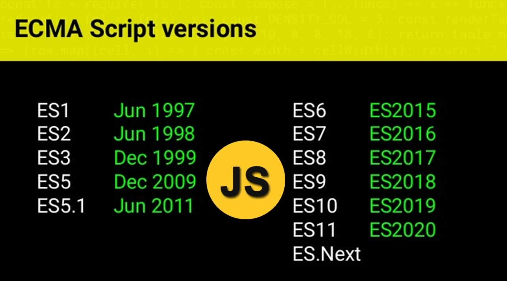

# DWEC UT01: Arquitecturas y lenguajes de programación en clientes web.

## Estructurar una pagina con HTML y JS

El esquema general de una página web es un documento HTML donde están todas las etiquetas HTML de la página. A lo largo de ese documento, pueden existir referencias o relaciones a otros documentos, como archivos CSS o archivos Javascript.

Por ejemplo, si dentro del documento HTML se encuentra una referencia a un archivo CSS, el navegador lo descarga y lo aplica al documento HTML, cambiando su apariencia visual. De la misma forma, si encuentra una referencia a un archivo Javascript, el navegador lo descarga y ejecuta las órdenes o acciones que allí se indican.

Los programas Javascript se pueden insertar casi en cualquier lugar de un documento HTML utilizando la etiqueta `<script>`.

### Ejemplo de script interno

```js
<!DOCTYPE HTML>
<html>
<body>
  <p>Zona antes del script...</p>
  <script>
    alert( 'Hola, mundo!' );
  </script>
  <p>... despues del script.</p>
</body>
</html>
```

### Ejemplo de script externo

```js
<!DOCTYPE HTML>
<html>
  <head>
    <title>Título de la página</title>
    <script src="js/index.js"></script>
  </head>
  <body>
    <p>Ejemplo de texto.</p>
  </body>
</html>
```

### Atributos opcionales

El texto `js/index.js` no es más que una referencia a un archivo index.js que se encuentra dentro de una carpeta js, situada en la misma carpeta que el documento HTML del ejemplo. Si en este archivo Javascript, incluímos el `console.log()` de mensaje de bienvenida, ese mensaje debería aparecer en la consola Javascript al cargar esta página.

La etiqueta `<script>` tiene algunos atributos que rara vez se usan hoy en día pero que aún se pueden encontrar en el código antiguo:

* El atributo de "type": `<script type=…>`
El antiguo estándar HTML, HTML4, requería que un script tuviera un tipo. Normalmente era tipo="text/javascript". Ya no es necesario. Además, el estándar HTML moderno cambió totalmente el significado de este atributo. Ahora se puede utilizar para módulos JavaScript.

* El atributo de "language": `<script language=…>`
Este atributo estaba destinado a mostrar el idioma de la escritura. Este atributo ya no tiene sentido porque JavaScript es el idioma predeterminado. No es necesario utilizarlo.

> ### *Tener en cuenta que ...*
> ... como regla general, sólo los scripts más simples se incluyen en HTML. Los más complejos residen en archivos separados.
La ventaja de un archivo independiente es que el navegador lo descargará y lo almacenará en su caché.
>Otras páginas que hacen referencia al mismo script lo tomarán del caché en lugar de descargarlo, por lo que el archivo en realidad se descarga solo una vez.
>Eso reduce el tráfico y hace que las páginas sean más rápidas.

### Ubicacion de la etiqueta `<script>`

Es posible que te hayas encontrado ejemplos donde dicha etiqueta esté ubicada en otra parte del documento HTML. Veamos las posibilidades:

| Ubicación | ¿Cómo descarga el archivo Javascript? | Estado de la página |
|----------|----------|----------|
| En `<head> `  | ANTES de empezar a dibujar la página.  | Página aún no dibujada.   |
| En `<body>`  |  DURANTE el dibujado de la página.  | Dibujada hasta donde está la etiqueta `<script>`.   |
| Después de `</body>`   | DESPUÉS de dibujar la página.   |  	Dibujada al 100%.   |

Ten en cuenta que el navegador puede descargar un documento Javascript en cualquier momento de la carga de la página y necesitamos saber cuál es el más oportuno para nosotros.

### Escritura de sentencias
A la hora de escribir sentencias, podemos agrupar varias en la misma línea pero tiene que estar separada por `;`.

```js
alert('Hola'); alert('Mundo');
```

Pero se suelen separar en líneas diferentes para favorecer la legibilidad.

```js
alert('Hola'); 
alert('Mundo');
```

Finalizar cada línea con `;` no es estrictamente necesario en versiones nuevas de ES. Se entiende que al haber un salto de línea se puede omitir `;`. Esto se conoce como "automatic semicolon insertion" [automatic semicolon insertion](https://tc39.es/ecma262/#sec-automatic-semicolon-insertion).

```js
alert('Hola')
alert('Mundo')
```

Hay casos en los que una línea nueva no implica siempre un `;`.

```js
alert(3 +
1
+ 2);
```

En este caso, el código nos mostrara un "6" ya que Javascript no inserta automaticamente `;`. Es intuitivo que la línea que acaba con un `+` está incompleta, asi que, no se necesita `;`.

Pero hay situaciones en las que JavaScript "no logra" asumir un punto y coma cuando realmente es necesario. Los errores que se producen en estos casos son bastante difíciles de encontrar y corregir.


### Utilización de comentarios 
A medida que pasa el tiempo, los programas se vuelven cada vez más complejos. Se hace necesario agregar comentarios que describan qué hace el código y por qué.

Los comentarios se pueden colocar en cualquier lugar de un script. No afectan su ejecución porque el motor simplemente los ignora.

```js
// This comment occupies a line of its own
alert('Hola');

alert('Mundo'); // This comment follows the statement
```

Los comentarios de una línea comienzan con dos caracteres de barra diagonal `//.`

Para realizar comentarios de líneas múltiples se utlizan `/* ... */`.

```js
/* Commenting out the code
alert('Hola');
*/
alert('Mundo');
```

## La especificación ECMAScript

ECMAScript es la especificación donde se mencionan todos los detalles de cómo debe funcionar y comportarse Javascript en un navegador. De esta forma, los diferentes navegadores (Chrome, Firefox, Opera, Edge, Safari...) saben como deben desarrollar los motores de Javascript para que cualquier código o programa funcione exactamente igual, independientemente del navegador que se utilice.

<p align="center"> 

<p align="center"><a href="https://www.tutorialspoint.com/javascript/javascript_versions.htm">Versiones de ECMAScript</a></p>
</p>

### La sentencia `use strict`

En el año 2009 cuando apareció ECMAScript 5 (ES5),se agregó nuevas funciones al lenguaje y modificó algunas de las existentes. Para que el código antiguo siga funcionando, la mayoría de estas modificaciones están desactivadas de forma predeterminada, debe habilitarlos explícitamente con una directiva especial: `"use strict"` o `'use strict'` al principio de 

```js
"use strict";

// this code works the modern way
...
```

Si la sentencia no esta al principio del script, sino no tendra efecto sobre el código del script. 
Una vez activado el modo "use strict" no hay forma de desactivarlo y retornar el motor al comportamiento antiguo.
